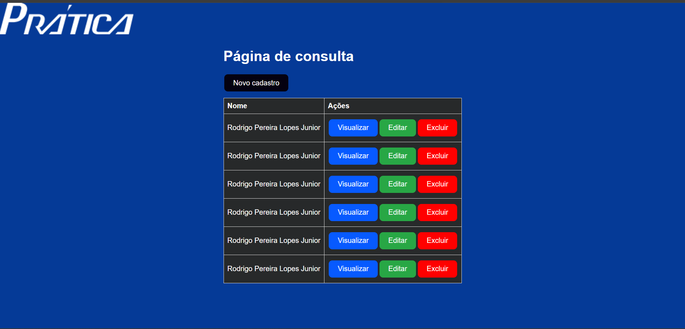

# Prática - API

This application is generated using [LoopBack 4 CLI](https://loopback.io/doc/en/lb4/Command-line-interface.html)


## Environment Setting

**Clone repository:**
```sh
git clone https://github.com/jrrodrigo421/control_of_technical_assistance_partner_companies
cd control_of_technical_assistance_partner_companies
```

## Install dependencies

By default, dependencies were installed when this application was generated.
Whenever dependencies in `package.json` are changed, run the following command:

```sh
npm install
```

To only install resolved dependencies in `package-lock.json`:

```sh
npm ci
```


## Configure the Database:

Create a SQL Server database.
Configure the database credentials in the datasources/praticadb.datasource.ts file.


## Run the application

```sh
npm start
```

You can also run `node .` to skip the build step.

Open http://127.0.0.1:3030 in your browser.

Open http://127.0.0.1:3030/explorer in your browser to check the API documentation


## Other useful commands

- `npm run migrate`: Migrate database schemas for models


## Tests

```sh
npm test
```

<br>
<br>
<br>

## Tela de Consulta:

