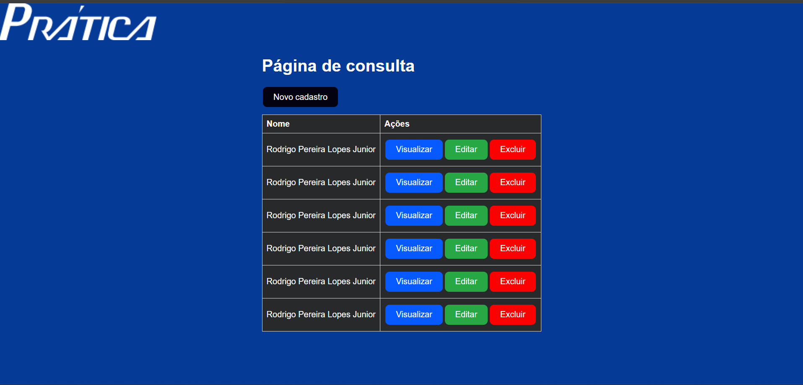

Sistema para controle das empresas parceiras de assistência técnica;

Projeto fullstack que permite o controle dos técnicos cadastrados no sistema e assim seu melhor gerenciamento, com possibilidade de visualização de detalhes, cadastramento de novos técnicos, edição e exlusão.

Tecnologias:

- Front End: React JS
- API: NodeJS (loopback/express)
- Banco de Dados: SQL Server

Obs: Para informações de execução do projeto, consulte o README.md.

Repositórios:

[BackEnd](https://github.com/jrrodrigo421/control_of_technical_assistance_partner_companies)

[FrontEnd](https://github.com/jrrodrigo421/Technician_Management_FRONT)

Futuros pontos de melhoria:
- Responsividade;
- Coluna histórico técnico onde o Admin do sistema consegue fazer anotações sobre aquele téncico;
- Coluna data de criação do técnico;
- layout do modal;
- Arquitetura do Front;

 
 
 

## Tela de Consulta:

